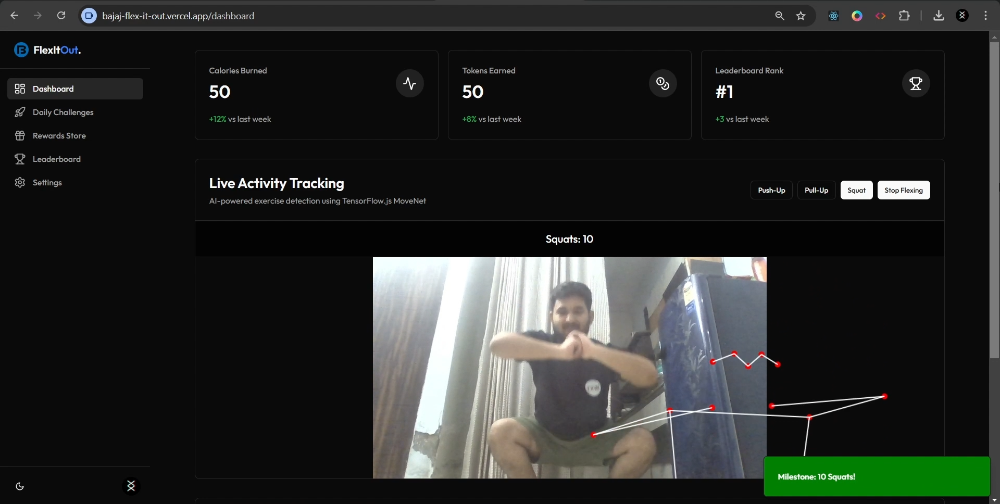

# Flex It Out | Bajaj



## Overview

Flex It Out is an innovative platform designed to engage users in daily challenges, rewarding their achievements and fostering a vibrant community. Leveraging advanced AI pose detection using TensorFlow.js, the platform offers an interactive and immersive user experience.

## Features

- **Daily Challenges**: Participate in new challenges every day to test and improve your skills.
- **Reward System**: Earn points and badges for completing challenges and climb the leaderboard.
- **AI Pose Detection**: Utilize real-time pose detection powered by TensorFlow.js for accurate performance tracking.
- **Secure Authentication**: Sign in seamlessly using Google OAuth or Email OTP, secured with JWT tokens.

## Tech Stack

- **Frontend/Backend**: Next.js, Node.js, TypeScript
- **Database**: MongoDB
- **Authentication**: NextAuth, Google OAuth, JWT-based Email OTP
- **Email Service**: Nodemailer
- **AI Pose Detection**: TensorFlow.js (MoveNet)
- **Deployment**: Vercel, GitHub

## Getting Started

1. **Clone the Repository**:
   ```bash
   git clone https://github.com/yourusername/flex-it-out.git
   ```
2. **Install Dependencies**:
   ```bash
   cd flex-it-out
   npm install
   ```
3. **Set Up Environment Variables**:
   - Create a `.env` file in the root directory.
   - Add the necessary environment variables as per `.env.example`.
4. **Run the Development Server**:
   ```bash
   npm run dev
   ```
   Visit `http://localhost:3000` to explore the application.

## Contributing

We welcome contributions from the community. To contribute:

1. Fork the repository.
2. Create a new branch: `git checkout -b feature/your-feature-name`.
3. Make your changes and commit them: `git commit -m 'Add some feature'`.
4. Push to the branch: `git push origin feature/your-feature-name`.
5. Open a pull request.